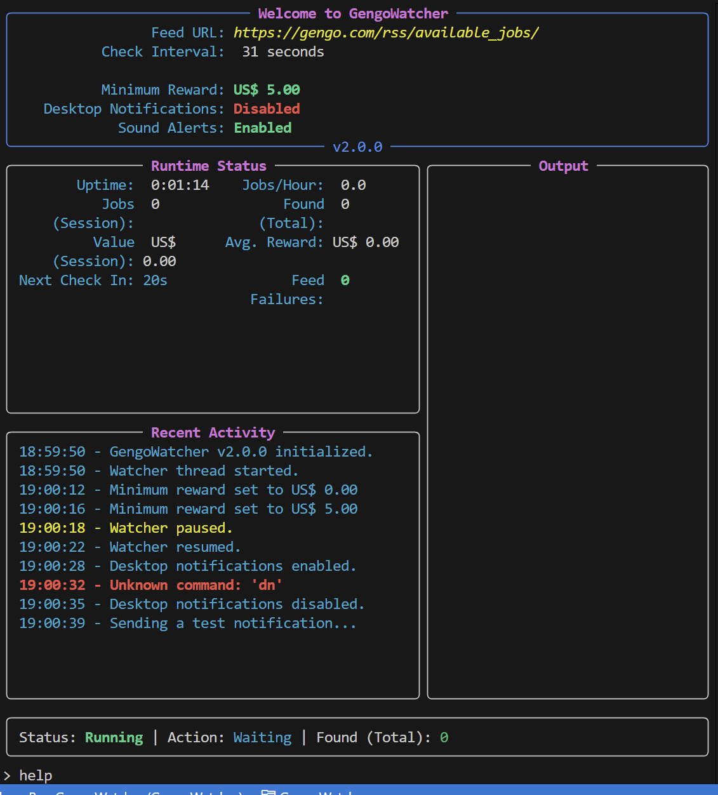

# GengoWatcher v2.0.0

GengoWatcher is a sophisticated terminal application designed to monitor RSS feeds, specifically for platforms like Gengo, to find and alert you to new freelance jobs the instant they become available. It features a rich, interactive text-based user interface (TUI) that runs directly in your terminal, providing real-time status updates and command controls.

---

## ✨ Key Features

- **Instant Notifications**: Opens new jobs in your browser immediately upon discovery. [2, 12]
- **Rich Interactive TUI**: A clean, modern interface that provides at-a-glance status, recent activity, and a list of available commands. [2, 11]
- **Cross-Platform**: Runs on Windows, macOS, and Linux. [2, 12]
- **Customizable Alerts**:
    - Filter jobs by a minimum reward value. [2, 11, 12]
    - Toggle desktop and sound alerts on/off. [2, 11, 12]
- **Interactive Controls**: Pause, resume, restart, and trigger manual checks on the fly. [2, 11]
- **Configuration on the Fly**: Adjust settings instantly with commands without needing to restart the application. [2, 11]
- **Robust & Efficient**: Handles connection errors with an exponential backoff strategy and automatically re-establishes connections. [12]
- **Persistent State**: Remembers the last job seen in `state.json`, so you only get notified about truly new entries. [10]
- **CSV Logging**: Optionally logs every job entry to a CSV file for historical data analysis. [12]

---



---

## 🚀 Installation

GengoWatcher is a Python application requiring Python 3.8 or newer.

**1. Clone the Repository**

```bash
git clone https://github.com/tdawe1/GengoWatcher.git
cd GengoWatcher
```

**2. Set Up a Virtual Environment (Highly Recommended)**

Using a virtual environment keeps project dependencies isolated from your system's global Python installation.

```bash
# Create a virtual environment
python -m venv venv

# Activate it
# On Windows:
venv\Scripts\activate
# On macOS/Linux:
source venv/bin/activate
```

**3. Install Dependencies**

```bash
pip install -r requirements.txt
```

---

## ⚙️ Configuration & Usage

**1. First Run**

Launch the application from your terminal:

```bash
python -m gengowatcher.main
```

The first time you run this, it will create a default `config.ini` file and then exit with a message.

**2. Configure the Application**

Before running again, you **must** open `config.ini` in a text editor and configure it.

- **`feed_url`**: This is the most important setting. Replace the default placeholder with your personal Gengo RSS feed URL.
- **`sound_file`**: On macOS/Linux, you should change the default path to a valid path for a sound file on your system.

**3. Launch**

Once configured, run the application again to start monitoring:

```bash
python -m gengowatcher.main
```

---

### 📝 Example `config.ini`

Below is an example of what your `config.ini` might look like after initial setup:

```ini
[DEFAULT]
feed_url = https://example.com/your-gengo-feed-url.xml
min_reward = 0.00
sound_alert = true
desktop_notification = true
sound_file = alert.wav
csv_logging = true
csv_log_path = logs/all_entries.csv

[ADVANCED]
check_interval = 30
backoff_max = 300
```

- Replace `feed_url` with your personal Gengo RSS feed URL.
- Adjust `min_reward`, `sound_file`, and other options as needed.

---

## ⌨️ Commands

Type commands directly into the TUI and press `Enter` to execute them.

| Command               | Aliases      | Description                                                 |
| --------------------- | ------------ | ----------------------------------------------------------- |
| `check`               |              | Trigger an immediate RSS feed check.                        |
| `help`                |              | Display the list of available commands.                     |
| `exit`                | `q`, `quit`  | Save the current state and exit the application.            |
| `pause`               | `p`          | Pause feed checks. A `gengowatcher.pause` file is created.  |
| `resume`              | `r`          | Resume feed checks by deleting the pause file.              |
| `togglesound`         | `ts`         | Toggle sound alerts on or off.                              |
| `togglenotifications` | `tn`         | Toggle desktop notifications on or off.                     |
| `setminreward <amt>`  | `smr <amt>`  | Set a minimum reward value (e.g., `smr 5.50`).              |
| `reloadconfig`        | `rl`         | Reload all settings from `config.ini`.                      |
| `restart`             |              | Restart the entire script.                                  |
| `notifytest`          | `nt`         | Send a test notification to check sound and alerts.         |
| `clear`               |              | Clear the command output panel.                             |

---

## 🐛 Troubleshooting

#### Terminal Flickering or Rendering Issues

This application uses a Text-Based User Interface (TUI) which draws and redraws itself rapidly. Older terminals (like the default `cmd.exe` or `powershell.exe` on Windows) may struggle to keep up, causing flickering or graphical glitches.

**Solution**: Use a modern, hardware-accelerated terminal for the best experience.
-   **Windows**: [**Windows Terminal**](https://aka.ms/terminal) (recommended, available on the Microsoft Store)
-   **macOS**: [**iTerm2**](https://iterm2.com/)
-   **Linux/Cross-Platform**: [**Alacritty**](https://alacritty.org/), [**Kitty**](https://sw.kovidgoyal.net/kitty/)

---

## 📜 License

This project is licensed under the MIT License. See the `LICENSE` file for details.