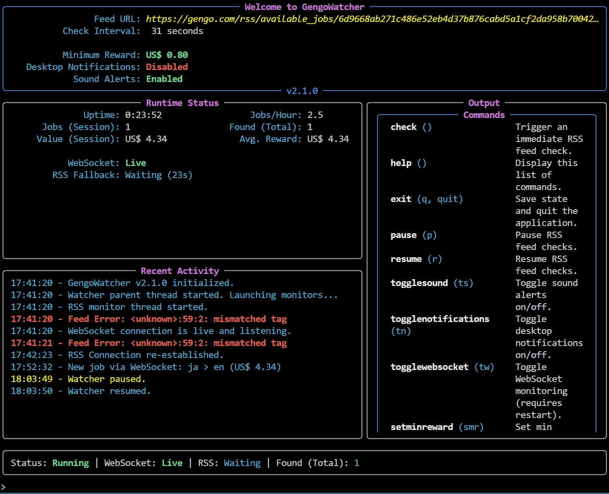

# GengoWatcher v2.1.0

GengoWatcher is a terminal application designed to find and alert you to new freelance jobs the instant they become available. It monitors both your personal Gengo RSS feed and a real-time WebSocket connection, ensuring maximum notification speed.

It features an interactive text-based user interface (TUI) that runs directly in your terminal, providing real-time status updates, activity logs, and command controls.

---

## ✨ Key Features

- **Dual-Source Monitoring**: Fetches jobs from both a personal RSS feed (as a fallback) and a real-time WebSocket connection, ensuring you get notified the second a job is available.
- **Zero-Config First Run**: Guides you through an interactive setup on first launch. No need to manually edit config files to get started
- **Rich Interactive TUI**: A clean, modern interface that provides at-a-glance status, recent activity, and a list of available commands.
- **Customizable Alerts**:
    - Filter jobs by a minimum reward value.
    - Toggle desktop and sound alerts on/off.
- **Interactive Controls**: Pause, resume, restart, and trigger manual checks on the fly.
- **Configuration on the Fly**: Adjust settings instantly with commands without needing to restart the application.
- **Robust & Efficient**: Handles connection errors with an exponential backoff strategy and automatically re-establishes connections.
- **Persistent State**: Remembers the last job seen in `state.json`, so you only get notified about truly new entries.
- **CSV Logging**: Optionally logs every job entry to a CSV file for historical data analysis.

---



---

## 📋 Table of Contents

- [✨ Key Features](#-key-features)
- [🚀 Installation](#-installation)
- [⚙️ Usage](#️-usage)
  - [📝 Example `config.ini`](#-example-configini)
- [⌨️ Commands](#️-commands)
- [🐛 Troubleshooting](#-troubleshooting)
- [📜 License](#-license)

---

## 🚀 Installation

GengoWatcher is a Python application requiring Python 3.8 or newer.

**1. Clone the Repository**

```bash
git clone https://github.com/tdawe1/GengoWatcher.git
cd GengoWatcher
```

**2. Set Up a Virtual Environment (Highly Recommended)**

Using a virtual environment keeps project dependencies isolated from your system's global Python installation.

```bash
# Create a virtual environment
python -m venv venv

# Activate it
# On Windows:
venv\Scripts\activate
# On macOS/Linux:
source venv/bin/activate
```

**3. Install Dependencies**

```bash
pip install -r requirements.txt
```

---

## ⚙️ Usage

**1. Launch the Application**

From your terminal, run:

```bash
python -m gengowatcher.main
```

**2. First-Time Setup**

The first time you run GengoWatcher, it will detect that it's a new installation and guide you through an interactive setup. It will ask for essential details needed for WebSocket and RSS monitoring.

> **How to find your Gengo `user_id` and `user_session`:**
>
> 1.  Log in to your Gengo dashboard in your web browser.
> 2.  Open your browser's Developer Tools (usually by pressing `F12` or `Ctrl+Shift+I`).
> 3.  Go to the **Network** tab.
> 4.  In the filter box, type `ws` or `websocket` to find the WebSocket connection. You should see an entry for `live-dashboard.gengo.com`.
> 5.  Click on this entry, and then look at the **Messages** or **Payload** tab.
> 6.  The very first message sent from your browser to the server will contain your `user_id` and `user_session` token. Copy these values into the terminal prompts.

**3. Start Monitoring**

After you complete the prompts, the application will automatically save your details to `config.ini` and begin monitoring for jobs.

---

### 📝 Example `config.ini`

The interactive setup will create a `config.ini` file for you. You can edit this file later to fine-tune your settings. It will look similar to this:

```ini
[Watcher]
feed_url = https://your-feed/rss.xml
check_interval = 31
min_reward = 0.0
enable_notifications = true
enable_sound = true
use_custom_user_agent = false

[WebSocket]
enable_websocket = true
user_id = 12345
user_session = your_long_session_token_here

[Paths]
sound_file = C:\Windows\Media\chimes.wav
log_file = logs/gengowatcher.log
notification_icon_path =
browser_path =
browser_args = --new-window {url}
all_entries_log = logs/all_entries.csv

[Logging]
log_max_bytes = 1000000
log_backup_count = 3
log_main_enabled = true
log_all_entries_enabled = true

[Network]
max_backoff = 300
user_agent_email = your_email@example.com
```

---

## ⌨️ Commands

Type commands directly into the TUI and press `Enter` to execute them.

| Command               | Aliases      | Description                                                 |
| --------------------- | ------------ | ----------------------------------------------------------- |
| `check`               |              | Trigger an immediate RSS feed check.                        |
| `help`                |              | Display the list of available commands.                     |
| `exit`                | `q`, `quit`  | Save the current state and exit the application.            |
| `pause`               | `p`          | Pause feed checks. A `gengowatcher.pause` file is created.  |
| `resume`              | `r`          | Resume feed checks by deleting the pause file.              |
| `togglesound`         | `ts`         | Toggle sound alerts on or off.                              |
| `togglenotifications` | `tn`         | Toggle desktop notifications on or off.                     |
| `togglewebsocket`     | `tw`         | Toggle WebSocket monitoring (requires restart).             |
| `setminreward <amt>`  | `smr <amt>`  | Set a minimum reward value (e.g., `smr 5.50`).              |
| `reloadconfig`        | `rl`         | Reload all settings from `config.ini`.                      |
| `restart`             |              | Restart the entire script.                                  |
| `notifytest`          | `nt`         | Send a test notification to check sound and alerts.         |
| `clear`               |              | Clear the command output panel.                             |

---

## 🐛 Troubleshooting

#### Terminal Flickering or Rendering Issues

This application uses a Text-Based User Interface (TUI) which draws and redraws itself rapidly. Older terminals (like the default `cmd.exe` or `powershell.exe` on Windows) may struggle to keep up, causing flickering or graphical glitches.

**Solution**: Use a modern, hardware-accelerated terminal for the best experience.
-   **Windows**: [**Windows Terminal**](https://aka.ms/terminal) (recommended, available on the Microsoft Store)
-   **macOS**: [**iTerm2**](https://iterm2.com/)
-   **Linux/Cross-Platform**: [**Alacritty**](https://alacritty.org/), [**Kitty**](https://sw.kovidgoyal.net/kitty/)

#### WebSocket Errors or Failures to Connect

GengoWatcher's WebSocket client may require specific HTTP headers to connect successfully. This functionality depends on a parameter (`extra_headers`) that is removed after the **11.0.3** release** of the `websockets` library.

**Symptom**: You see errors in the "Recent Activity" panel related to "unexpected keyword argument 'extra_headers'" or other WebSocket connection failures, even with correct credentials.

**Solution**: Ensure you are using a compatible version of the `websockets` library.
1.  Check your installed version:
    ```bash
    pip show websockets
    ```


---

## 📜 License

This project is licensed under the MIT License. See the `LICENSE` file for details.

