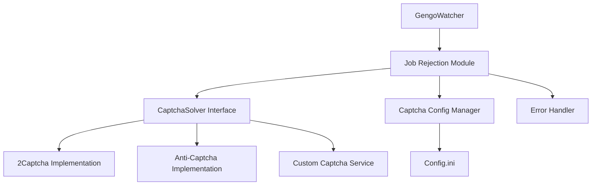

# Captcha Solving Service Integration Specification

## 1. Overview

Based on research showing that Gengo requires captcha solving for job rejection (but not acceptance), this document outlines the architecture and implementation plan for integrating captcha solving services into the GengoWatcher application.

The integration will enable automatic job rejection functionality when users want to filter out jobs that don't meet their criteria, without requiring manual captcha solving.

## 2. Architectural Components

### 2.1 Core Components

1. **CaptchaSolver Interface** - Abstract base class defining the contract for captcha solving services
2. **Service Implementations** - Concrete implementations for different captcha solving providers
3. **Captcha Configuration Manager** - Handles service configuration and credentials
4. **Job Rejection Module** - Integrates with GengoWatcher to automatically reject jobs
5. **Error Handling & Fallback System** - Manages failures and provides graceful degradation

### 2.2 Component Diagram



## 3. Integration Points

### 3.1 Existing Code Modifications

1. **Config.py** - Add new configuration sections for captcha services
2. **Watcher.py** - Add job rejection functionality
3. **UI.py** - Add user interface for configuring captcha settings
4. **Main.py** - Initialize captcha components

### 3.2 New Modules

1. **captcha_solver.py** - Core captcha solving interface and implementations
2. **job_rejection.py** - Job rejection logic with captcha integration
3. **captcha_config.py** - Configuration management for captcha services

## 4. Service Provider Options

### 4.1 Primary Providers

| Provider | Pros | Cons | Cost Model | Documentation |
|----------|------|------|------------|---------------|
| **2Captcha** | High success rate, good API, extensive documentation | Can be slower during peak times | ~$0.50-3.00 per 1000 captchas | https://2captcha.com/ |
| **Anti-Captcha** | Fast processing, good success rate | Slightly more expensive | ~$0.50-2.00 per 1000 captchas | https://anti-captcha.com/ |
| **CapSolver** | Competitive pricing, good support | Newer provider | ~$0.50-2.00 per 1000 captchas | https://www.capsolver.com/ |

### 4.2 Recommended Implementation Approach

1. **Primary**: 2Captcha (most established with good success rates)
2. **Secondary**: Anti-Captcha (fallback option)
3. **Configuration**: Allow users to select and configure their preferred provider

## 5. Implementation Details

### 5.1 Configuration Schema

Add to `config.ini`:

```ini
[Captcha]
enabled = false
provider = 2captcha
api_key = YOUR_API_KEY_HERE
timeout = 120
retry_attempts = 3
min_balance = 0.10

[JobRejection]
auto_reject_enabled = false
reject_below_reward = 0.0
reject_languages = 
```

### 5.2 CaptchaSolver Interface

```python
from abc import ABC, abstractmethod
from typing import Optional, Dict, Any
import asyncio

class CaptchaSolver(ABC):
    """Abstract base class for captcha solving services."""
    
    @abstractmethod
    async def solve_recaptcha(self, site_key: str, page_url: str) -> Optional[str]:
        """Solve reCAPTCHA v2/v3."""
        pass
    
    @abstractmethod
    async def solve_image_captcha(self, image_data: bytes) -> Optional[str]:
        """Solve image-based captcha."""
        pass
    
    @abstractmethod
    async def get_balance(self) -> float:
        """Get account balance."""
        pass
    
    @abstractmethod
    async def report_bad_solution(self, captcha_id: str) -> bool:
        """Report incorrectly solved captcha."""
        pass
```

### 5.3 Job Rejection Workflow

1. User configures auto-rejection criteria (e.g., minimum reward)
2. When a job is detected that meets rejection criteria:
   - Check if captcha solving is enabled and configured
   - Extract captcha challenge from Gengo rejection page
   - Submit captcha to solving service
   - Wait for solution (with timeout)
   - Submit solution to Gengo to complete rejection
   - Log result and update statistics

## 6. Error Handling and Fallback Mechanisms

### 6.1 Error Categories

1. **Configuration Errors** - Missing API keys, invalid settings
2. **Service Errors** - Provider API issues, rate limiting
3. **Network Errors** - Connectivity problems
4. **Captcha Errors** - Unsolvable captchas, timeouts
5. **Gengo Errors** - Rejection failures, session issues

### 6.2 Fallback Strategies

1. **Provider Fallback** - Try secondary captcha provider if primary fails
2. **Graceful Degradation** - Disable auto-rejection if repeated failures occur
3. **Manual Fallback** - Notify user to manually solve captcha if automated solving fails
4. **Retry Logic** - Exponential backoff for transient failures

### 6.3 Error Handling Implementation

```python
class CaptchaError(Exception):
    """Base exception for captcha-related errors."""
    pass

class CaptchaServiceError(CaptchaError):
    """Error from captcha service provider."""
    pass

class CaptchaTimeoutError(CaptchaError):
    """Timeout while waiting for captcha solution."""
    pass

class InsufficientBalanceError(CaptchaError):
    """Insufficient balance in captcha service account."""
    pass
```

## 7. Security Considerations

1. **API Key Protection** - Store securely, never log
2. **Rate Limiting** - Respect provider rate limits
3. **Balance Monitoring** - Alert when balance is low
4. **Session Management** - Secure handling of Gengo session tokens

## 8. Performance Requirements

1. **Response Time** - Captcha solving should not significantly delay job notifications
2. **Concurrency** - Support multiple simultaneous captcha solving requests
3. **Resource Usage** - Minimal memory and CPU overhead
4. **Caching** - Cache solved captchas when appropriate

## 9. Testing Strategy

### 9.1 Unit Tests

1. Test captcha solver interface implementations
2. Test configuration validation
3. Test error handling scenarios
4. Test fallback mechanisms

### 9.2 Integration Tests

1. Test with mock captcha service APIs
2. Test job rejection workflow with simulated Gengo responses
3. Test provider switching functionality

### 9.3 Manual Testing

1. Test with actual captcha service accounts
2. Test real job rejection scenarios
3. Test error recovery scenarios

## 10. Implementation Phases

### Phase 1: Core Infrastructure (Week 1)
- Implement CaptchaSolver interface
- Create 2Captcha implementation
- Add configuration management
- Add basic error handling

### Phase 2: Integration (Week 2)
- Integrate with job detection
- Implement job rejection logic
- Add UI configuration options
- Implement fallback mechanisms

### Phase 3: Testing & Refinement (Week 3)
- Comprehensive testing
- Performance optimization
- Documentation
- User feedback collection

## 11. Monitoring and Logging

### 11.1 Key Metrics

1. Captcha solve success rate
2. Average solve time
3. Service uptime
4. Rejection success rate
5. Cost tracking

### 11.2 Logging Requirements

1. Successful captcha solves
2. Failed attempts with reasons
3. Provider switching events
4. Balance updates
5. Configuration changes

## 12. Documentation Requirements

1. User guide for captcha integration setup
2. API documentation for captcha modules
3. Troubleshooting guide for common issues
4. Provider-specific configuration instructions