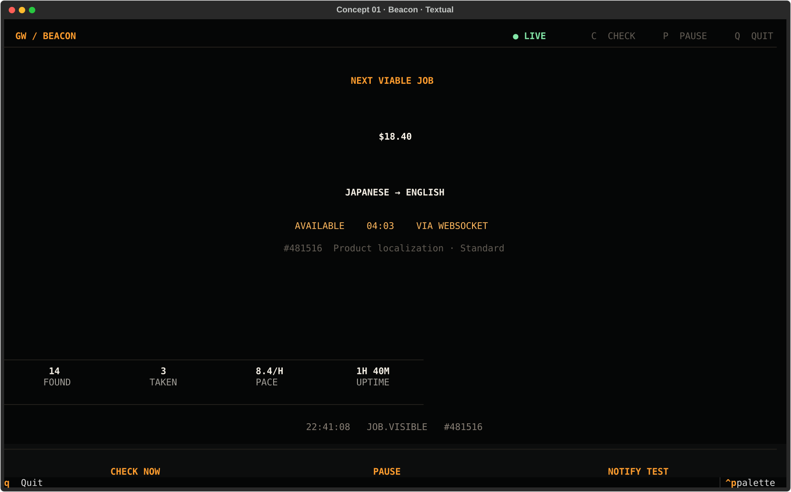
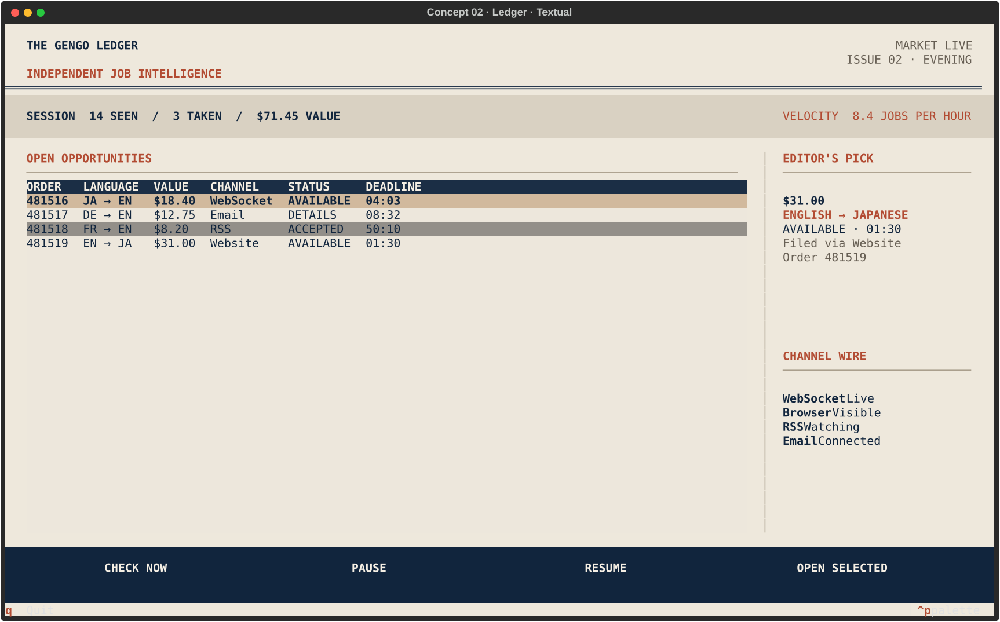
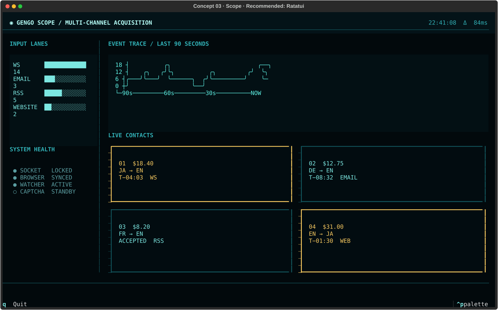
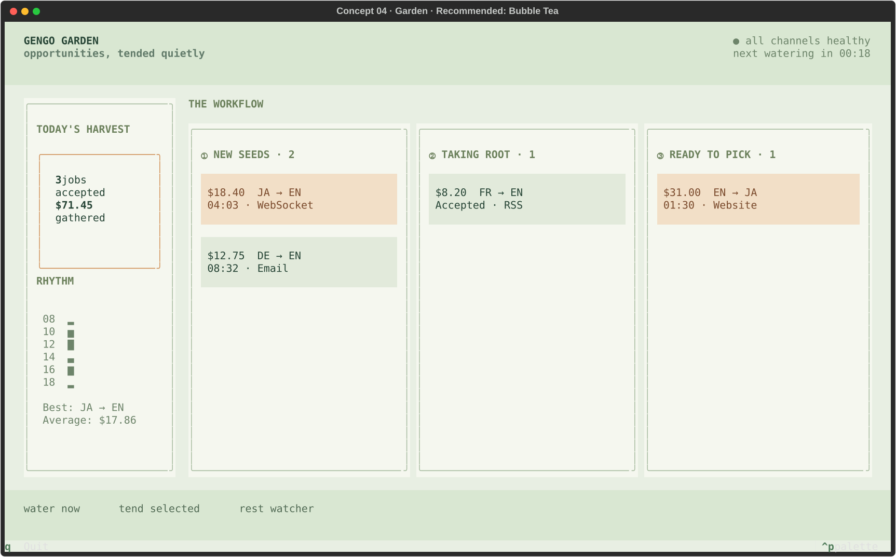
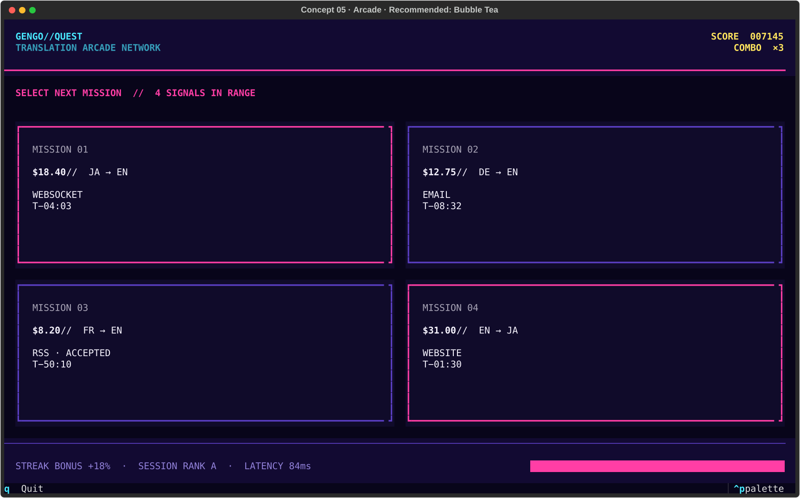

# GengoWatcher TUI direction gallery

These are separate concepts, not tabs or themes. Choose the information model
and tone first; framework implementation comes afterwards.

## 01 — Beacon

**Recommended:** Python + Textual
**Idea:** The app is an alert instrument. One opportunity dominates the screen;
everything else becomes quiet peripheral telemetry. Best when the primary task
is deciding quickly whether the current job matters.

## 02 — Ledger

**Recommended:** Python + Textual
**Idea:** The app is an editorial market sheet. It optimizes comparison,
inspection, and mouse/table navigation rather than atmosphere. This is the most
practical high-information direction.

## 03 — Scope

**Recommended:** Rust + Ratatui
**Idea:** The app is a diagnostic instrument. Sources are signal lanes, jobs are
contacts, and event timing is a trace. Best if watcher health and low latency are
as important as the queue itself.

## 04 — Garden

**Comparison implementations:** Python + Textual and Rust + Ratatui
**Idea:** The app is a comprehensive operations dashboard. Its Overview combines
the current alert, available jobs, active work, session metrics, system health,
and recent activity; five focused workspaces expand those same areas.

## 05 — Arcade

**Recommended:** Go + Bubble Tea + Lip Gloss
**Idea:** The app is a fast reward board. Urgency, value, selection, and streaks
are explicit. It supports energetic motion and keyboard-first selection, but is
the least restrained direction.

## Framework shorthand

- Python: **Textual**
- Rust: **Ratatui** with Crossterm
- Go: **Bubble Tea** with Lip Gloss and Bubbles
